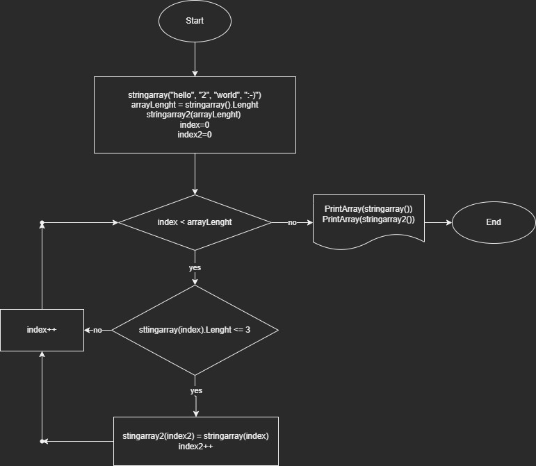

# Финальная работа 1 семестра студента Данилова О.П.

## 1. Вводная часть
В соответствии с техническим заданием необходимо создать программу, которая из имеющегося строкового массива выбирает все значания с длиной строки 3 символа и менее, на основе которого создает новый массив, после чего оба массива выводятся на экран.
***
## 2. Решение
На представленной блок-схеме решения:

видно, что задача реализована путем:
- создания массива stringarray, в котором содержатся исходные элементы массива
- присвоению переменой arrayLenght значению длины массива stringarray
- создания массива с результатами stringarray2, длиной в arrayLenght 
- присвоению счетчику index, предназначеному для перебора значений исходного массива stringarray, значения 0
- присвоению счетчику index2, предназначеному для перебора значений результирующего массива stringarray2, значения 0
- организации цикла, путем перебра значений stringarray до достижения переменной arrayLenght, по результатам чего путем использования метода PrintArray последовательно выводятся исходный массив stringarray и результат выборки stringarray2
- внутри тела цикла проводится проверка значения длины index-ного элемента массива stringarray на длину меньше 4 символов, при положительном ответе index-ное значение stringarray записывается в index2-ное значение массива stringarray2, после чего производится инкремент значения index2

## 3. Заключительная часть

Таким образом, имеющееся решение способно производить заданную выборку для любого числа значений, предварительно заданных в массив stringarray, что соответствует техническому заданию.

